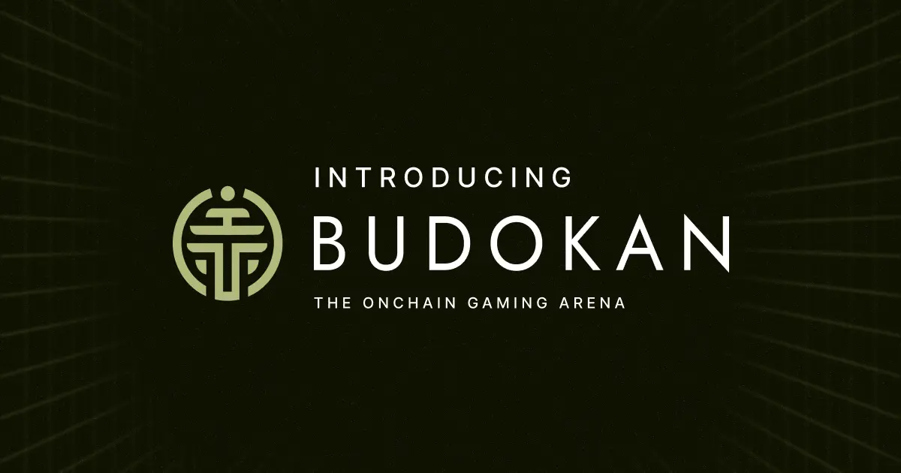
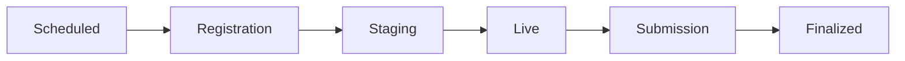

# Budokan Tournament Platform

<div align="center">
  
</div>

A permissionless, fully on-chain tournament management system built with Dojo on StarkNet. Budokan enables anyone to create, manage, and participate in gaming tournaments with flexible entry requirements, prize distribution, and seamless integration with external game systems.

## Table of Contents

- [Overview](#overview)
- [Core Capabilities](#core-capabilities)
- [Architecture](#architecture)
  - [Tournament Lifecycle](#tournament-lifecycle)
  - [Smart Contract Layer](#smart-contract-layer)
  - [Data Models](#data-models)
  - [Core Workflows](#core-workflows)
  - [External Integrations](#external-integrations)
- [Development](#development)
- [Resources](#resources)

## Overview

Budokan is a comprehensive tournament infrastructure that manages the complete lifecycle of gaming competitions on StarkNet. Built on Cairo 2.10.1 and Dojo 1.5.0, it provides a robust foundation for permissionless competitive gaming with:

- **Permissionless Creation**: Anyone can launch tournaments with custom configurations
- **Flexible Access Control**: Token-gating, tournament-gating, allowlists, or custom validators
- **Multi-Prize Support**: Entry fee pools and sponsored prizes (ERC20/ERC721)
- **On-Chain Leaderboards**: Ordered score tracking with batch submission support
- **Automated Distribution**: Prize claims for winners, creators, and game developers
- **Game Integration**: Seamless connection with external game systems via standardized interfaces

## Core Capabilities

### 🎮 Tournament Lifecycle Management

Budokan implements a **6-phase state machine** for tournament progression:

```
Scheduled → Registration → Staging → Live → Submission → Finalized
```

- **Scheduled**: Tournament announced, awaiting registration period
- **Registration**: Players enter and mint game tokens (optional phase)
- **Staging**: Pre-game buffer between registration close and tournament start
- **Live**: Active tournament gameplay period
- **Submission**: Score submission window after gameplay concludes
- **Finalized**: Tournament complete, prizes claimable

Each phase transition is time-based and validated on-chain, with configurable durations:
- Registration: 15 minutes to 1 month
- Tournament: 15 minutes to 1 year
- Submission: 15 minutes to 1 week

### 🔐 Flexible Entry Control

Budokan supports multiple entry requirement patterns:

- **Token-Gated**: Require ownership of specific ERC721 tokens
- **Tournament-Gated**: Restrict to winners or participants of previous tournaments
- **Allowlist**: Pre-approved address lists for exclusive tournaments
- **Custom Validators**: Extensible via `IEntryValidator` interface for custom logic
- **Entry Limits**: Optional caps on entries per qualification proof
- **Open Access**: No requirements for permissionless participation

### 💰 Multi-Tiered Prize Distribution

**Entry Fee Prizes** (from entry fee pool):
- Position-based rewards (1st, 2nd, 3rd, etc.)
- Configurable splits between winners, tournament creators, and game developers
- Automated calculation based on leaderboard placement

**Sponsored Prizes** (third-party deposits):
- ERC20 token amounts for specific positions
- ERC721 NFTs as unique rewards
- Deposited anytime before tournament ends
- Independent from entry fee pool

**Creator Rewards**:
- Automatic creator token minting on tournament creation
- Enables tournament organizers to claim their share
- Incentivizes high-quality tournament curation

### 🎯 On-Chain Score Management

- **Ordered Leaderboards**: Position-based insertion with gap validation
- **Batch Submissions**: Submit up to 30 scores per transaction
- **Score Verification**: Validates against game contract data
- **Duplicate Prevention**: Each game token can submit once
- **Real-time Updates**: Leaderboard changes indexed by Torii for live UI updates

### 🔌 Game Integration Interface

Budokan connects to external games via standardized interfaces:

**IMinigameToken** - Game token contract requirements:
- `mint()`: Create game tokens with tournament context
- `get_score()`: Retrieve final scores for submission
- `get_settings()`: Fetch available game configurations

**IMetagame** - Tournament context tracking:
- `game_context()`: Global game metadata
- `tournament_context()`: Per-token tournament data

This enables any compatible game to integrate without modifying Budokan contracts.

## Architecture

### Tournament Lifecycle

Budokan's architecture centers on a state machine that manages tournament progression through distinct phases:



Each phase has specific capabilities:
- **Scheduled**: Tournament visible, no actions available
- **Registration**: Entry validation, game token minting, fee collection
- **Staging**: Pre-game preparation, no new entries
- **Live**: Active gameplay (managed by game contract)
- **Submission**: Score submission to leaderboard
- **Finalized**: Prize claiming enabled

### Smart Contract Layer

The Budokan smart contract (`contracts/src/budokan.cairo`) implements the `IBudokan` interface using Dojo's entity system on StarkNet. Core responsibilities include:

- **Tournament Lifecycle**: Validates state transitions based on timestamp-driven phases
- **Entry Validation**: Processes entry requirements through modular validator interfaces
- **Token Operations**: Coordinates with game contracts for token minting
- **Leaderboard Management**: Maintains ordered score arrays with insertion validation
- **Prize Distribution**: Calculates and transfers entry fee + sponsored prizes
- **Token Registry**: Tracks registered ERC20/ERC721 contracts for prize support

**Architecture Principles**:
- **Minimal On-Chain Logic**: Complex operations delegated to pure Cairo functions in `libs/`
- **Extensive Testing**: All core logic covered by comprehensive unit tests
- **Modular Design**: Entry validators, prize handlers, and game integrations are extensible
- **Dojo Entity System**: Uses WorldStorage for efficient model-based data access

### Data Models

**Tournament Model**:
```cairo
#[derive(Drop, Serde)]
#[dojo::model]
pub struct Tournament {
    #[key]
    pub id: u64,
    pub created_at: u64,
    pub created_by: ContractAddress,
    pub creator_token_id: u64,
    pub metadata: Metadata,
    pub schedule: Schedule,
    pub game_config: GameConfig,
    pub entry_fee: Option<EntryFee>,
    pub entry_requirement: Option<EntryRequirement>,
}
```

**Core Supporting Models**:
- **Registration**: Links game tokens to tournaments (enables entry tracking)
- **Leaderboard**: Ordered array of `(token_id, score)` pairs for ranking
- **Prize**: Sponsored prize metadata (token, amount, position)
- **PrizeClaim**: Tracks claimed prizes to prevent double-claiming
- **Token**: Registry of approved ERC20/ERC721 contracts
- **PlatformMetrics**: Global statistics (tournament count, total prizes, etc.)

### Core Libraries (`contracts/src/libs/`)

These libraries contain pure Cairo functions that implement core business logic, enabling comprehensive unit testing outside of blockchain execution:

- **`store.cairo`**: WorldStorage abstraction with CRUD operations for all Dojo models
- **`schedule.cairo`**: Phase calculation, validation, and timestamp-based state transitions
- **`lifecycle.cairo`**: Tournament state machine, entry validation, score ordering, prize calculation
- **`utils.cairo`**: Mathematical operations, array manipulation, validation helpers

**Design Philosophy**: All complex logic resides in these pure functions with exhaustive unit tests. The main contract acts as a thin validation and orchestration layer.

### Core Workflows

#### Tournament Creation
```
1. Validate schedule timestamps and phase durations
2. Validate game config (contract address, settings)
3. Validate entry requirements (if applicable)
4. Mint creator token (enables creator to claim rewards)
5. Store Tournament model with all configuration
6. Update PlatformMetrics (increment tournament count)
7. Emit TournamentCreated event
```

#### Tournament Entry
```
1. Validate current phase is Registration (or no registration phase)
2. Validate entry requirements via appropriate validator
3. Transfer entry fee from player to contract (if applicable)
4. Call game contract to mint token with tournament context
5. Store Registration model linking token to tournament
6. Increment tournament entry count
7. Emit TournamentEntered event
```

#### Score Submission
```
1. Validate current phase is Submission
2. Fetch score from game contract via get_score()
3. Validate token hasn't already submitted
4. Calculate insertion position in leaderboard (binary search)
5. Validate no position gaps (positions must be sequential)
6. Insert score into Leaderboard array at proper position
7. Mark Registration as submitted
8. Emit ScoreSubmitted event
```

#### Prize Claiming
```
1. Validate tournament phase is Finalized
2. Determine claimer type (winner, creator, game dev)
3. Check PrizeClaim hasn't been created for this prize
4. Calculate prize amount based on type:
   - Entry fee prize: Calculate from pool splits
   - Sponsored prize: Use deposited amount
5. Transfer tokens from contract to claimer
6. Store PrizeClaim record
7. Emit PrizeClaimed event
```

### External Integrations

#### Game Contract Integration

Budokan integrates with external game systems through standardized Cairo interfaces:

**IMinigameToken** - Required interface for all compatible games:
```cairo
trait IMinigameToken {
    fn mint(ref self, tournament_id: u64) -> u64;           // Create game token
    fn get_score(self: @T, token_id: u64) -> u256;         // Retrieve score
    fn get_settings(self: @T) -> Array<Setting>;           // Available configs
}
```

**IMetagame** - Tournament context tracking:
```cairo
trait IMetagame {
    fn game_context(self: @T) -> Context;                           // Global game info
    fn tournament_context(self: @T, token_id: u64) -> TournamentContext;  // Per-token data
}
```

**Integration Points**:
1. **Tournament Creation**: Validates game contract address and available settings
2. **Entry**: Calls `mint()` on game contract with tournament context
3. **Score Submission**: Calls `get_score()` to fetch player results
4. **Creator Rewards**: Optional token registry for game developer profit sharing

Any Cairo contract implementing these interfaces can integrate with Budokan without platform modifications.

#### Denshokan Token Registry (Optional)

When configured, Budokan can integrate with Denshokan for enhanced game discovery:
- Centralized registry mapping game IDs to contracts
- Standardized metadata for game information
- Simplified game contract lookups

Currently operates with direct token registration as an alternative.

## Resources

- **Dojo Documentation**: [book.dojoengine.org](https://book.dojoengine.org/)
- **StarkNet Docs**: [docs.starknet.io](https://docs.starknet.io/)
- **Cairo Book**: [book.cairo-lang.org](https://book.cairo-lang.org/)
- **Provable Games**: [github.com/Provable-Games](https://github.com/Provable-Games)
